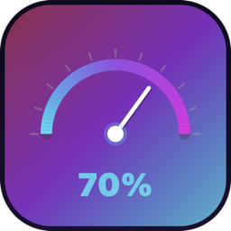
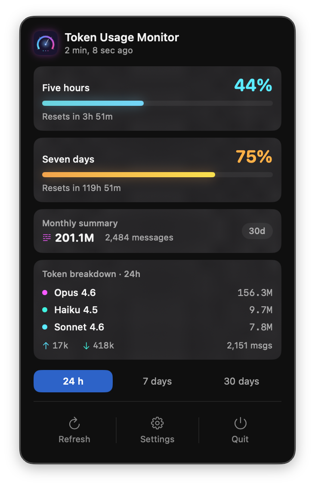
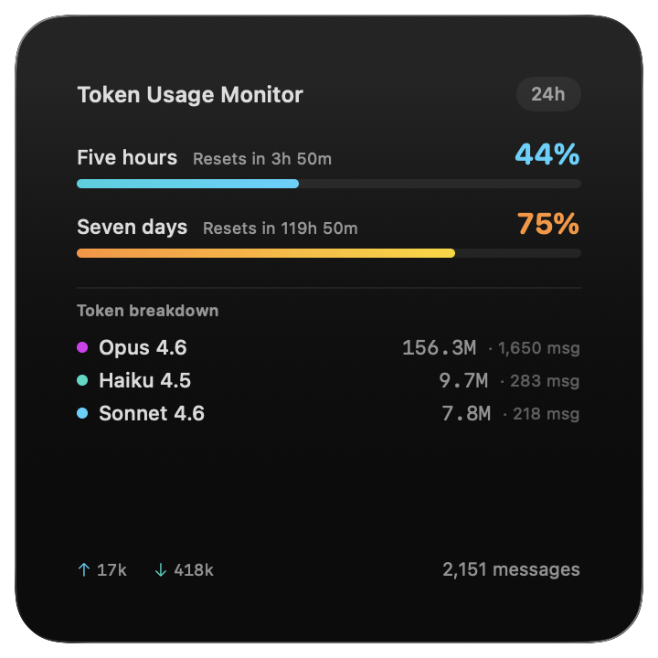
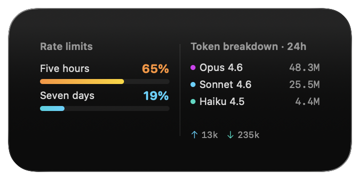
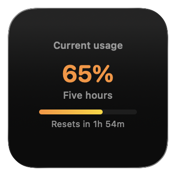
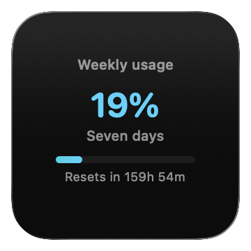

<p align="center">
  
</p>

<h1 align="center">Token Usage Monitor</h1>

<p align="center">
  Monitor your Claude AI usage limits directly from your macOS menu bar and desktop widgets.
</p>

<p align="center">
  <a href="https://github.com/MaksymTaran25/TokenUsageMonitor/releases/latest"></a>
  <a href="https://github.com/MaksymTaran25/TokenUsageMonitor/releases"></a>
  
  
  
  
  
<a href="LICENSE"></a>
</p>

> **Disclaimer:** This is an unofficial, community-built tool. It is **not affiliated with, endorsed by, or supported by Anthropic**. It uses undocumented APIs that may change or break at any time. Use at your own risk.

---

## Screenshots

### Menu Bar Popover

<p align="center">
  
</p>

### Widgets

<p align="center">
  
</p>

<p align="center">
  
</p>

<p align="center">
  
  &nbsp;&nbsp;&nbsp;
  
</p>

---

## Features

- **Menu bar app** - live percentage display of your current rate limit usage
- **Three widget sizes** - small, medium, and large desktop widgets via WidgetKit
- **Weekly widget** - dedicated small widget for seven-day usage tracking
- **Token breakdown** - per-model stats (Opus, Sonnet, Haiku) parsed from local Claude logs
- **Monthly summary** - 30-day cumulative token and message counts
- **Customizable layout** - show/hide and drag-to-reorder sections in the menu bar popover
- **Time windows** - switch between 24h, 7-day, and 30-day views for token stats
- **Rate limit handling** - graceful fallback when API returns 429, shows last known data
- **Auto-refresh** - polls usage data every 5 minutes in the background

## Prerequisites

- **macOS 14.0** (Sonoma) or later
- **Claude Code CLI** installed and signed in:
  ```bash
  npm install -g @anthropic-ai/claude-code
  claude login
  ```
- A **Claude Pro, Max, or Team** subscription (free plans do not expose usage data)

## Install

### Option 1 - Homebrew

```bash
brew tap MaksymTaran25/tap
brew install --cask token-usage-monitor
```

### Option 2 - Download DMG

Download the latest `.dmg` from [Releases](https://github.com/MaksymTaran25/TokenUsageMonitor/releases), open it, and drag the app to Applications.

### Option 3 - Build from source

Requirements: Xcode 16+, [XcodeGen](https://github.com/yonaskolb/XcodeGen) (`brew install xcodegen`)

```bash
git clone https://github.com/MaksymTaran25/TokenUsageMonitor.git
cd TokenUsageMonitor
./build.sh        # builds the .app
./build.sh dmg    # builds and packages into a DMG
```

Or open in Xcode manually:

```bash
./generate.sh     # generates project and opens Xcode
# Press Cmd + R to build and run
```

> On first launch, macOS may block the app. Go to **System Settings → Privacy & Security** and click **Open Anyway**.

After launching, add widgets by right-clicking the desktop → **Edit Widgets** → search "Token Usage Monitor".

## Project Structure

```
TokenUsageMonitor/
├── Shared/
│   └── UsageData.swift              # Models shared between app and widgets
├── TokenUsageMonitor/
│   ├── TokenUsageMonitorApp.swift   # App entry point (MenuBarExtra)
│   ├── MenuBarView.swift            # Menu bar popover UI
│   ├── DataManager.swift            # State management and refresh logic
│   ├── UsageAPI.swift               # Anthropic OAuth usage endpoint
│   ├── UsageParser.swift            # Local JSONL log parser
│   ├── OAuthManager.swift           # Keychain credential loading
│   └── SettingsManager.swift        # User preferences persistence
├── TokenUsageMonitorWidgetExtension/
│   ├── TokenUsageMonitorWidget.swift # Widget definitions and timeline
│   └── WidgetViews.swift            # Small/medium/large widget UIs
├── project.yml                       # XcodeGen project config
├── build.sh                          # Build and package script
└── generate.sh                       # Xcode project generation
```

## How It Works

1. **OAuth credentials** are read from the macOS Keychain (stored by Claude Code CLI) - no manual token setup required
2. **Rate limit data** is fetched from Anthropic's internal OAuth usage endpoint (`/api/oauth/usage`)
3. **Token breakdown** is parsed from Claude Code's local JSONL conversation logs in `~/.claude/projects/`
4. Data is shared between the menu bar app and widgets via an App Group container file

## Troubleshooting

**App is blocked by macOS on first launch**
Go to **System Settings → Privacy & Security** and click **Open Anyway**.

**Widgets show "No data"**
Open the main app at least once so it can fetch and write data to the shared container. Then right-click a widget → **Edit Widget** to force a refresh.

**"No quota data" in widgets / menu bar shows "–%"**
The app reads rate limit data from Anthropic's OAuth endpoint. This requires:
- Claude Code CLI to be installed and signed in (`claude login`)
- A Claude Pro, Max, or Team subscription (free plans do not expose usage data)

**Token breakdown shows 0 or no activity**
Make sure `~/.claude/projects/` exists and contains JSONL conversation logs. These are written by Claude Code as you use it.

**Widgets stop updating**
macOS may suspend widget timelines to save power. Open the main app to trigger a manual refresh, which also calls `WidgetCenter.shared.reloadAllTimelines()`.

**Build fails with provisioning error**
If building from source, open `project.yml` and set `DEVELOPMENT_TEAM` to your own Apple Developer team ID, or remove the line entirely for local development.

---

## License

[Source-Available](LICENSE) - free for personal, non-commercial use. Commercial use and resale require written permission from the author.
